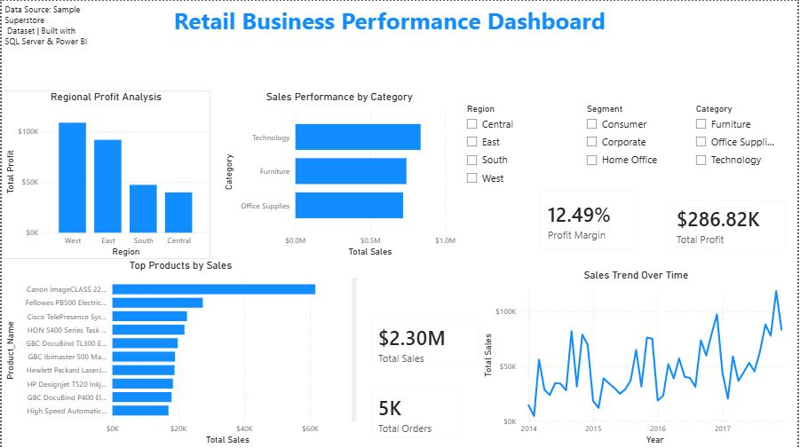
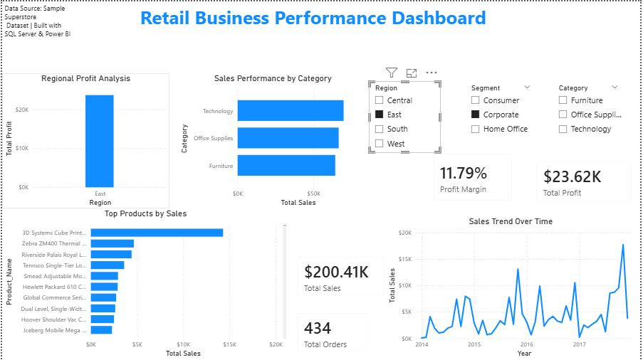
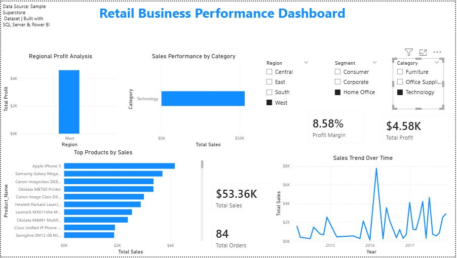

## Retail Business Performance Analytics





### Project Overview
This project is an end-to-end retail business analytics solution built using SQL Server and Power BI.
The goal of the project is to analyze retail sales performance, clean and transform raw data using SQL, and create an interactive Power BI dashboard for business decision-making.
This project simulates a real company workflow where raw sales data is imported into SQL Server, cleaned and prepared for analysis, and then connected to Power BI for dashboard reporting.

---

### Business Problem
A retail company wants to understand its overall business performance across sales, profit, products, categories, customer segments, and regions.
Management needs answers to questions such as:
- What is the total sales performance?
- What is the total profit and profit margin?
- Which product categories generate the highest sales?
- Which regions are most profitable?
- What are the sales trends over time?
- Which products contribute the most to revenue?
- How do customer segments and categories affect business performance?

---

### Tools & Technologies Used
- Microsoft SQL Server
- SQL Server Management Studio 22
- Power BI Desktop
- VS Code
- Git
- GitHub
- SourceTree

---

### Data Pipeline
The project follows a simple business intelligence pipeline:
```text
CSV Dataset
→ SQL Server Raw Table
→ SQL Data Validation
→ SQL Cleaning & Transformation
→ Clean Analytical Table
→ Power BI Dashboard
```

#### Project Structure
retail-business-performance-analytics/
│
├── data/
│   └── raw/
│       └── sample_superstore.csv
│
├── images/
│   └── dashboard_preview.png
│
├── powerbi/
│   └── retail_dashboard.pbix
│
├── sql/
│   ├── 01_create_database.sql
│   ├── 02_create_table.sql
│   ├── 03_data_cleaning.sql
│   ├── 04_business_analysis.sql
│   └── 05_create_clean_table.sql
│
├── README.md
└── .gitignore

### SQL Work Completed
The SQL part of this project includes:
Database creation
Raw CSV data import
Data validation
NULL value checks
Duplicate checks
Clean analytical table creation
Business KPI queries
Sales and profit analysis
Regional performance analysis
Product performance analysis
Monthly sales trend analysis

### Power BI Dashboard Features
The Power BI dashboard includes:
Total Sales KPI
Total Profit KPI
Total Orders KPI
Profit Margin KPI
Regional Profit Analysis
Sales Performance by Category
Top Products by Sales
Sales Trend Over Time
Interactive slicers for:
Region
Segment
Category
Key Business Insights
Technology generated the highest sales among product categories.
The West region showed strong profitability compared to other regions.
Sales performance varied over time, showing visible trend changes across years.
A small number of products contributed significantly to total revenue.
Interactive filters allow users to analyze business performance by region, segment, and category.
How to Open and Run This Project

### 1. Clone the Repository
Clone this repository from GitHub to your local machine.
git clone https://github.com/StojkoskiT/retail-business-performance-analytics.git
Open the project folder in VS Code.

### 2. Open SQL Server Management Studio
Open Microsoft SQL Server Management Studio 22 and connect to your local SQL Server instance.
Example server names:
localhost
or
.\SQLEXPRESS

### 3. Create the Database
Open and run:
sql/01_create_database.sql
This creates the database:
RetailBusinessAnalytics

### 4. Import the Raw Dataset
In SQL Server Management Studio:
Right-click the database RetailBusinessAnalytics
Select Tasks
Select Import Flat File
Choose the file:
data/raw/sample_superstore.csv
Import the file as:
retail_sales_raw

### 5. Run SQL Cleaning Scripts
Run the following scripts in order:
sql/03_data_cleaning.sql
sql/04_business_analysis.sql
sql/05_create_clean_table.sql
The final clean table used for Power BI is:
retail_sales_clean

### 6. Open the Power BI Dashboard
Open Power BI Desktop.
Then open:
powerbi/retail_dashboard.pbix
If needed, update the SQL Server connection to your local SQL Server instance.

### 7. Refresh the Dashboard
In Power BI:
Go to Home
Click Refresh
Make sure the dashboard loads data from:
RetailBusinessAnalytics.dbo.retail_sales_clean
Dashboard Preview

### Future Improvements
Possible future improvements include:
Adding customer retention analysis
Adding sales forecasting
Creating more advanced DAX measures
Publishing the dashboard to Power BI Service
Adding automated SQL refresh workflows
Creating a star schema data model
Project Purpose

This project was built to demonstrate practical business intelligence and data analytics skills, including SQL Server data preparation, business KPI analysis, Power BI dashboard design, and GitHub-based project documentation.
